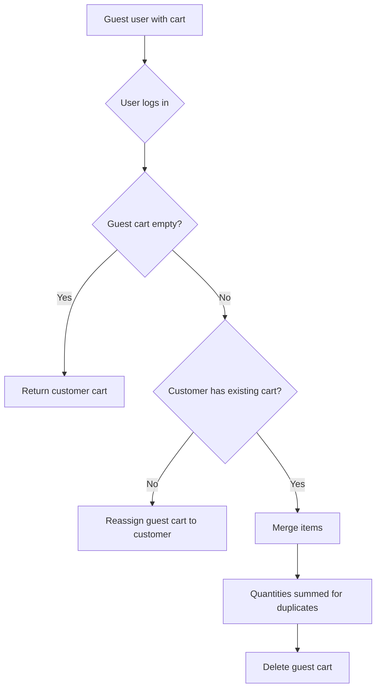

# Swift Shop — Backend Features & Specification

> Complete architecture of NestJS v11 backend with GraphQL (Apollo), Prisma ORM, PostgreSQL, Redis, BullMQ, MeiliSearch.

---

## Table of Contents

1. [Global Architecture](#1-global-architecture)
2. [Authentication & Authorization](#2-authentication--authorization)
3. [Product Catalog](#3-product-catalog)
4. [Pricing Engine](#4-pricing-engine)
5. [Cart](#5-cart)
6. [Orders](#6-orders)
7. [Payments](#7-payments)
8. [Shipping](#8-shipping)
9. [Notifications](#9-notifications)
10. [Messaging & Emails](#10-messaging--emails)
11. [Customer Support](#11-customer-support)
12. [Social Media](#12-social-media)
13. [Analytics & Dashboard](#13-analytics--dashboard)
14. [Media & Files](#14-media--files)
15. [Employee Management](#15-employee-management)
16. [Customer Groups](#16-customer-groups)
17. [Addresses](#17-addresses)
18. [Settings & Configuration](#18-settings--configuration)
19. [Async Systems & Queue](#19-async-systems--queue)
20. [Security](#20-security)
21. [CDC Scenarios — User Tutorials](#21-cdc-scenarios--user-tutorials)
22. [Endpoints Summary](#22-endpoints-summary)
23. [Production Maturity Score](#23-production-maturity-score)

---

## 1. Global Architecture

### Tech Stack

| Component      | Technology                         | Version |
| -------------- | ---------------------------------- | ------- |
| Framework      | NestJS                             | v11     |
| API            | Apollo GraphQL (code-first) + REST | -       |
| Runtime        | Bun (Node.js 22)                   | -       |
| ORM            | Prisma                             | Latest  |
| Database       | PostgreSQL                         | 16      |
| Cache / Broker | Redis                              | 7       |
| Search Engine  | MeiliSearch                        | v1.7    |
| Queue          | BullMQ (Redis-backed)              | -       |
| Auth           | JWT + Argon2 + 2FA TOTP + OAuth2   | -       |
| Validation     | class-validator + ValidationPipe   | -       |
| Logging        | nestjs-pino                        | -       |
| Queue UI       | Bull Board                         | -       |

### Nx Monorepo Structure

```
swift-shop/
├── apps/
│   ├── api/                ← NestJS Backend (entry point)
│   ├── store/              ← Angular Frontend (storefront)
│   └── dashboard/          ← Angular Frontend (admin)
├── libs/
│   ├── backend/
│   │   ├── core/           ← Cross-cutting modules (auth, media, search)
│   │   └── features/       ← 16 business feature modules
│   ├── data-access-prisma/ ← PrismaService (data access layer)
│   └── ui/                 ← Shared Angular components
├── prisma/
│   ├── schema.prisma       ← Complete schema (~1392 lines, 40+ models)
│   ├── migrations/
│   └── seed.ts
└── docker-compose.yml      ← 6 Docker services
```

### NestJS Modules (24)

| Module                | Responsibility                                        |
| --------------------- | ----------------------------------------------------- |
| `AuthModule`          | JWT, 2FA, OAuth2, magic links, audit                  |
| `CustomerModule`      | Customer CRUD, customer auth                          |
| `EmployeeModule`      | Employee CRUD, employee auth, RBAC                    |
| `CustomerGroupModule` | Customer groups / segments                            |
| `AddressModule`       | Address management                                    |
| `CatalogModule`       | Products, categories, attributes, stock, combinations |
| `PricingModule`       | Price calculation, taxes, specific prices             |
| `CartModule`          | Cart, coupons, stock reservation                      |
| `OrderModule`         | Orders, invoices, exports                             |
| `ShippingModule`      | Carriers, zones, rates, tracking                      |
| `PaymentModule`       | Payment adapters, webhooks                            |
| `AnalyticsModule`     | Dashboards, charts, top products                      |
| `SearchModule`        | MeiliSearch (product indexing)                        |
| `MediaModule`         | File upload, video processing                         |
| `SettingsModule`      | Store settings, currencies, languages                 |
| `SocialMediaModule`   | Facebook / Instagram                                  |
| `MessagingModule`     | Emails, templates, SMTP sending                       |
| `NotificationModule`  | In-app, push, SMS notifications                       |
| `SupportModule`       | Support tickets                                       |
| `HealthModule`        | Health checks (HTTP, memory, DB)                      |

---

## 2. Authentication & Authorization

### 2.1 Customer Authentication Flows

| Operation                             | Type     | Guard                | Description                                                                             |
| ------------------------------------- | -------- | -------------------- | --------------------------------------------------------------------------------------- |
| `customerRegister(input)`             | Mutation | `AuthRateLimitGuard` | Registration: checks unique email, hashes password (Argon2), generates JWT, audit       |
| `customerLogin(email, password)`      | Mutation | `AuthRateLimitGuard` | Login: validates credentials, merges guest cart, detects session anomalies, returns JWT |
| `customerRefreshToken(token)`         | Mutation | -                    | Refreshes an expired JWT                                                                |
| `customerLogout`                      | Mutation | `CustomerGuard`      | Logout: revokes token (JTI blacklist in Redis)                                          |
| `customerOAuth2AuthorizationUrl(...)` | Mutation | `AuthRateLimitGuard` | Generates OAuth2 URL (Google/Facebook) with PKCE                                        |
| `customerOAuth2Login(...)`            | Mutation | `AuthRateLimitGuard` | Exchanges OAuth2 code, returns JWT                                                      |
| `requestCustomerMagicLink(email)`     | Mutation | `AuthRateLimitGuard` | Sends magic link by email                                                               |
| `customerLoginWithMagicLink(token)`   | Mutation | `AuthRateLimitGuard` | Verifies magic link, returns JWT                                                        |

### 2.2 Employee Authentication Flows

| Operation                                                    | Type     | Guard                | Description                                |
| ------------------------------------------------------------ | -------- | -------------------- | ------------------------------------------ |
| `employeeLogin(email, password, totp?, trustedDeviceToken?)` | Mutation | `AuthRateLimitGuard` | Login with optional 2FA and trusted device |
| `generateEmployeeTwoFactor`                                  | Mutation | `EmployeeGuard`      | Generates TOTP secret + QR code            |
| `enableEmployeeTwoFactor(totp)`                              | Mutation | `EmployeeGuard`      | Enables 2FA after TOTP verification        |
| `disableEmployeeTwoFactor(totp)`                             | Mutation | `EmployeeGuard`      | Disables 2FA                               |
| `completeEmployeeForcedPasswordReset(token, password)`       | Mutation | -                    | Forced password reset                      |
| `employeeRefreshToken(token)`                                | Mutation | -                    | Refreshes employee JWT                     |
| `employeeLogout`                                             | Mutation | `EmployeeGuard`      | Employee logout                            |

### 2.3 RBAC Guards Hierarchy

```
JwtAuthGuard (JWT validation)
  └── EmployeeGuard (type === 'employee')
        ├── SuperAdminGuard (role slug 'super_admin')
        ├── PermissionGuard (granular permissions, Redis cache 300s)
        ├── RoleGuard (role slugs from DB)
        └── StoreBranchScopeGuard (branch-level access)
  └── CustomerGuard (type === 'customer')
```

### 2.4 Security Features

- **Password Hash**: Argon2 (not bcrypt)
- **JWT**: Access token 15 min + refresh token rotation
- **Token Blacklist**: JTI in Redis
- **2FA TOTP**: otplib + qrcode for QR display
- **OAuth2 PKCE**: Google and Facebook
- **Magic Links**: Passwordless login (customer)
- **Trusted Devices**: Bypass 2FA on registered devices
- **Rate Limiting**: Redis-backed throttler on auth endpoints
- **Audit Logging**: All auth events logged
- **Anomaly Detection**: Compares IP and User-Agent across sessions
- **Environment Validation**: Required variables in production (SMTP, OAuth, etc.)

---

## 3. Product Catalog

### 3.1 Queries & Mutations

| Operation                                                         | Type     | Guard             | Description                                                   |
| ----------------------------------------------------------------- | -------- | ----------------- | ------------------------------------------------------------- |
| `products(filter?)`                                               | Query    | -                 | Paginated list with filters (category, active, text search)   |
| `product(id)`                                                     | Query    | -                 | Product detail (images, combinations, stock, reviews, labels) |
| `checkProductAvailability(productId?, combinationId?, quantity?)` | Query    | -                 | Checks available stock                                        |
| `createProduct(input)`                                            | Mutation | `SuperAdminGuard` | Product creation                                              |
| `updateProduct(id, input)`                                        | Mutation | `SuperAdminGuard` | Update (audits price changes)                                 |
| `duplicateProduct(id)`                                            | Mutation | `SuperAdminGuard` | Product duplication                                           |
| `deleteProduct(id)`                                               | Mutation | `SuperAdminGuard` | Deletion                                                      |
| `addProductImage(productId, input)`                               | Mutation | `SuperAdminGuard` | Add image                                                     |
| `removeProductImage(id)`                                          | Mutation | `SuperAdminGuard` | Remove image                                                  |
| `setProductCoverImage(imageId)`                                   | Mutation | `SuperAdminGuard` | Set cover image                                               |
| `addProductCombination(productId, input)`                         | Mutation | `SuperAdminGuard` | Add variant (size+color)                                      |
| `updateProductCombination(id, input)`                             | Mutation | `SuperAdminGuard` | Update variant                                                |
| `deleteProductCombination(id)`                                    | Mutation | `SuperAdminGuard` | Delete variant                                                |
| `updateStock(input)`                                              | Mutation | `SuperAdminGuard` | Stock replacement                                             |
| `incrementStock(stockId, quantity)`                               | Mutation | `SuperAdminGuard` | Stock increment                                               |
| `decrementStock(stockId, quantity)`                               | Mutation | `SuperAdminGuard` | Stock decrement                                               |

### 3.2 REST Endpoints

| Method | Path                       | Description                  |
| ------ | -------------------------- | ---------------------------- |
| `GET`  | `api/products/bulk/export` | Export products (.xlsx)      |
| `POST` | `api/products/bulk/import` | Import products (.xlsx/.csv) |

### 3.3 Advanced Features

- **DataLoader**: N+1 prevention on category children and combination attributes
- **MeiliSearch Sync**: Automatic indexing on create/update/delete
- **Price Audit**: Automatic log on price changes
- **Category Tree**: Self-referencing hierarchical structure
- **Auto-generated Slug**: From product name

---

## 4. Pricing Engine

### 4.1 Calculation Pipeline

```
Base product price
  → + Combination price impact
  → - Customer group discount (%)
  → - Specific price (if applicable)
  → - Cart rule (coupon, promotion)
  → × Exchange rate
  → + Tax (by country)
  → = Loyalty points (floor(priceTTC / 10))
```

### 4.2 Operations

| Operation                                                                                                     | Type     | Guard             | Description                     |
| ------------------------------------------------------------------------------------------------------------- | -------- | ----------------- | ------------------------------- |
| `calculatePrice(productId, countryId, combinationId?, customerId?, quantity?, currencyCode?, cartRuleCodes?)` | Query    | -                 | Full calculation with breakdown |
| `specificPrices(productId?, customerId?)`                                                                     | Query    | `SuperAdminGuard` | List specific prices            |
| `createSpecificPrice(input)`                                                                                  | Mutation | `SuperAdminGuard` | Create specific price rule      |
| `updateSpecificPrice(id, input)`                                                                              | Mutation | `SuperAdminGuard` | Update                          |
| `deleteSpecificPrice(id)`                                                                                     | Mutation | `SuperAdminGuard` | Delete                          |

### 4.3 Price Rules

| Type               | Description                                        |
| ------------------ | -------------------------------------------------- |
| Base Price         | Catalog price of product                           |
| Combination Impact | Surcharge/discount per variant (size, color)       |
| Group Discount     | Percentage discount per customer segment           |
| Specific Price     | Promotional price per product/customer/country/qty |
| Cart Rule          | Coupon or global promotion                         |
| Exchange Rate      | Currency conversion                                |
| Tax                | VAT by country                                     |
| Loyalty Points     | 1 point per 10€ TTC                                |

---

## 5. Cart

### 5.1 Operations

| Operation                              | Type     | Guard                   | Description                                        |
| -------------------------------------- | -------- | ----------------------- | -------------------------------------------------- |
| `myCart`                               | Query    | `OptionalCustomerGuard` | Current cart (guest or authenticated, auto-merge)  |
| `cart`                                 | Query    | `CustomerGuard`         | Cart with calculated totals                        |
| `addToCart(input)`                     | Mutation | `OptionalCustomerGuard` | Add item (product, quantity, optional combination) |
| `updateCartItem(cartItemId, quantity)` | Mutation | `OptionalCustomerGuard` | Update quantity                                    |
| `removeCartItem(cartItemId)`           | Mutation | `OptionalCustomerGuard` | Remove item                                        |
| `clearCart`                            | Mutation | `OptionalCustomerGuard` | Clear cart                                         |
| `applyCoupon(input)`                   | Mutation | `OptionalCustomerGuard` | Apply coupon (WELCOME10, FREESHIP)                 |
| `removeCoupon(cartId)`                 | Mutation | `OptionalCustomerGuard` | Remove coupon                                      |
| `reserveCartStock(cartId)`             | Mutation | `OptionalCustomerGuard` | Stock reservation (TTL 15 min)                     |

### 5.2 Coupon System

| Code        | Type       | Value | Description       |
| ----------- | ---------- | ----- | ----------------- |
| `WELCOME10` | Percentage | 10%   | Cart discount     |
| `FREESHIP`  | Fixed      | 5€    | Shipping discount |

### 5.3 Stock Management

- **Redis Reservation**: TTL 15 minutes, key per cart/item
- **Availability Check**: Available stock = stock qty - other cart reservations
- **OOS Behavior**: `deny` (refuse) or `notify` (notify)

### 5.4 Guest Cart → Customer Merge



---

## 6. Orders

### 6.1 Operations

| Operation                                  | Type         | Guard           | Description                                         |
| ------------------------------------------ | ------------ | --------------- | --------------------------------------------------- |
| `myOrders`                                 | Query        | `CustomerGuard` | Customer's order list                               |
| `order(id)`                                | Query        | `CustomerGuard` | Order detail                                        |
| `orderStates`                              | Query        | -               | Possible states (pending, shipped, delivered, etc.) |
| `exportMyOrders(format?)`                  | Query        | `CustomerGuard` | Export CSV/XLSX                                     |
| `createOrder(input)`                       | Mutation     | `CustomerGuard` | Order creation (idempotent)                         |
| `createGuestOrder(input)`                  | Mutation     | -               | Guest order                                         |
| `generateInvoice(orderId)`                 | Mutation     | `CustomerGuard` | PDF invoice generation                              |
| `reorder(orderId)`                         | Mutation     | `CustomerGuard` | Recreate cart from order                            |
| `cancelOrder(id)`                          | Mutation     | `CustomerGuard` | Cancellation + stock rollback                       |
| `requestReturn(input)`                     | Mutation     | `CustomerGuard` | Return request (delivered only)                     |
| `addOrderNote(orderId, note, isInternal?)` | Mutation     | `CustomerGuard` | Add note (internal or customer-visible)             |
| `orderStatusChanged(orderId)`              | Subscription | `CustomerGuard` | Real-time status tracking                           |

### 6.2 Order Creation Logic

```
1. Check idempotencyKey (if already processed, return existing order)
2. Validate non-empty cart belonging to customer
3. Resolve shipping/billing addresses (snapshot)
4. Reserve stock (Redis TTL)
5. Prisma Transaction:
   a. Generate reference: DO-YYYYMMDD-XXXXX
   b. Create order with cart totals
   c. Snapshot addresses
   d. Create order items with price details
   e. Decrement stock (atomic, checks availability)
   f. Clear cart
6. Release stock reservation
```

### 6.3 Cancellation

- Verifies order not already cancelled, shipped, or delivered
- Updates status to `CANCELLED`
- Creates order history
- **Stock Rollback**: increments quantity for each item (including combinations)

---

## 7. Payments

### 7.1 Operations

| Operation                      | Type     | Guard | Description                    |
| ------------------------------ | -------- | ----- | ------------------------------ |
| `initiatePayment(input)`       | Mutation | -     | Initiates payment (idempotent) |
| `verifyPayment(paymentId)`     | Mutation | -     | Verifies status with provider  |
| `processRefund(input)`         | Mutation | -     | Partial/full refund            |
| `processPaymentWebhook(input)` | Mutation | -     | Signature-verified webhook     |

### 7.2 Payment Adapters

| Provider         | Code          | Status                     |
| ---------------- | ------------- | -------------------------- |
| Stripe           | `stripe`      | Integrated (local adapter) |
| Mvola            | `mvola`       | Integrated (local adapter) |
| Airtel Money     | `airtelmoney` | Integrated (local adapter) |
| PayPal           | `paypal`      | Integrated (local adapter) |
| Cash on Delivery | `cod`         | Integrated (local adapter) |
| Manual           | `manual`      | Integrated (local adapter) |

### 7.3 Webhook Security

- Signature verification before processing
- Webhook events logged in `PaymentWebhookEvent`
- Automatic payment status update

---

## 8. Shipping

### 8.1 Operations

| Operation                                                           | Type     | Guard | Description                          |
| ------------------------------------------------------------------- | -------- | ----- | ------------------------------------ |
| `availableCarriers(input)`                                          | Query    | -     | Available carriers by country/weight |
| `createShipment(input)`                                             | Mutation | -     | Creates shipment record              |
| `updateShipmentStatus(shipmentId, status, description?, location?)` | Mutation | -     | Updates tracking status              |
| `syncShipmentTracking(shipmentId)`                                  | Mutation | -     | Syncs from carrier                   |

### 8.2 Carrier Adapters

| Carrier   | Code        | Status     |
| --------- | ----------- | ---------- |
| Colissimo | `colissimo` | Integrated |
| DHL       | `dhl`       | Integrated |
| FedEx     | `fedex`     | Integrated |
| Local MG  | `local_mg`  | Integrated |
| Manual    | `manual`    | Integrated |

### 8.3 Pricing Logic

- Finds active shipping zone by country code
- Filters rates by weight range (min/max)
- Returns carriers sorted by ascending price

---

## 9. Notifications

### 9.1 Operations

| Operation                              | Type         | Guard           | Description                  |
| -------------------------------------- | ------------ | --------------- | ---------------------------- |
| `myNotifications(limit?, unreadOnly?)` | Query        | `JwtAuthGuard`  | User notifications           |
| `notificationUnreadCount`              | Query        | `JwtAuthGuard`  | Unread count                 |
| `sendNotification(input)`              | Mutation     | `EmployeeGuard` | Send notification (employee) |
| `markNotificationAsRead(id)`           | Mutation     | `JwtAuthGuard`  | Mark as read                 |
| `updateNotificationPreference(input)`  | Mutation     | `JwtAuthGuard`  | Preferences (channels, freq) |
| `registerPushSubscription(input)`      | Mutation     | `JwtAuthGuard`  | Browser push subscription    |
| `notificationReceived`                 | Subscription | `JwtAuthGuard`  | Real-time stream             |

### 9.2 Delivery Channels

| Channel | Description                           |
| ------- | ------------------------------------- |
| In-App  | In-app notifications (SSE)            |
| Push    | Browser push notifications (web push) |
| SMS     | Text messages                         |
| Email   | Email sending (via BullMQ)            |

### 9.3 REST Endpoint

| Method | Path                       | Description          |
| ------ | -------------------------- | -------------------- |
| `GET`  | `api/notifications/stream` | Real-time SSE stream |

---

## 10. Messaging & Emails

### 10.1 Features

- **Email Templates**: Creation and management of templates
- **Threads**: Email conversation with history
- **SMTP Sending**: Via BullMQ (`email` queue)
- **Attachments**: Attachment support

### 10.2 Email Queue

| Queue   | Job          | Priority | Attempts                   |
| ------- | ------------ | -------- | -------------------------- |
| `email` | `SEND_EMAIL` | NORMAL   | 3 (exponential backoff 2s) |

---

## 11. Customer Support

### 11.1 Operations

| Operation                              | Type     | Guard           | Description            |
| -------------------------------------- | -------- | --------------- | ---------------------- |
| `createSupportTicket(input)`           | Mutation | `CustomerGuard` | Create ticket          |
| `replyToTicket(ticketId, input)`       | Mutation | `CustomerGuard` | Customer reply         |
| `agentReplyToTicket(ticketId, input)`  | Mutation | `EmployeeGuard` | Agent reply            |
| `assignSupportTicket(ticketId, input)` | Mutation | `EmployeeGuard` | Assign to agent        |
| `supportTickets`                       | Query    | `EmployeeGuard` | All tickets (employee) |
| `mySupportTickets`                     | Query    | `CustomerGuard` | Customer's tickets     |

---

## 12. Social Media

### 12.1 Features

- **Facebook/Instagram Publishing**: Via BullMQ
- **Scheduling**: Scheduled publishing (cron every minute)
- **Catalog Sync**: Facebook Catalog synchronization

### 12.2 Queue

| Queue          | Job            | Priority    | Attempts           |
| -------------- | -------------- | ----------- | ------------------ |
| `social-media` | `PUBLISH_POST` | HIGH/NORMAL | 3 (exp backoff 2s) |
| `social-media` | `SYNC_CATALOG` | LOW         | 2 (exp backoff 5s) |

---

## 13. Analytics & Dashboard

### 13.1 Operations

| Operation                            | Type     | Guard                   | Description             |
| ------------------------------------ | -------- | ----------------------- | ----------------------- |
| `getDashboardStats(from?, to?)`      | Query    | `SuperAdminGuard`       | Global statistics       |
| `getSalesChart(from?, to?)`          | Query    | `SuperAdminGuard`       | Sales chart data        |
| `getTopProducts(from?, to?, limit?)` | Query    | `SuperAdminGuard`       | Top 10 selling products |
| `trackProductView(input)`            | Mutation | `OptionalCustomerGuard` | Product view tracking   |

---

## 14. Media & Files

### 14.1 REST Endpoint

| Method | Path               | Description                               |
| ------ | ------------------ | ----------------------------------------- |
| `POST` | `api/media/upload` | Upload and process image (multer + sharp) |

### 14.2 Video Queue

| Queue              | Job      | Priority | Attempts           |
| ------------------ | -------- | -------- | ------------------ |
| `video-processing` | `RESIZE` | NORMAL   | 3 (exp backoff 2s) |
| `video-processing` | `MERGE`  | HIGH     | 2 (exp backoff 5s) |

---

## 15. Employee Management

### 15.1 Operations

| Operation                   | Type     | Guard             | Description                            |
| --------------------------- | -------- | ----------------- | -------------------------------------- |
| `employeeMe`                | Query    | `EmployeeGuard`   | Connected employee profile             |
| `employees`                 | Query    | `SuperAdminGuard` | Employee list                          |
| `employee(id)`              | Query    | `SuperAdminGuard` | Employee detail                        |
| `createEmployee(input)`     | Mutation | `SuperAdminGuard` | Creation (hash password, default role) |
| `updateEmployee(id, input)` | Mutation | `SuperAdminGuard` | Update                                 |
| `deleteEmployee(id)`        | Mutation | `SuperAdminGuard` | Deletion                               |

### 15.2 Default Roles

- `support_agent` or `SALES` if no role specified

---

## 16. Customer Groups

### 16.1 Operations

| Operation                        | Type     | Guard           | Description                 |
| -------------------------------- | -------- | --------------- | --------------------------- |
| `customerGroups`                 | Query    | `EmployeeGuard` | Group list                  |
| `customerGroup(id)`              | Query    | `EmployeeGuard` | Group detail                |
| `createCustomerGroup(input)`     | Mutation | `EmployeeGuard` | Creation (checks duplicate) |
| `updateCustomerGroup(id, input)` | Mutation | `EmployeeGuard` | Update                      |
| `deleteCustomerGroup(id)`        | Mutation | `EmployeeGuard` | Deletion                    |

---

## 17. Addresses

### 17.1 Operations

| Operation                  | Type     | Guard           | Description                   |
| -------------------------- | -------- | --------------- | ----------------------------- |
| `myAddresses`              | Query    | `CustomerGuard` | Customer addresses            |
| `address(id)`              | Query    | `CustomerGuard` | Detail (ownership verified)   |
| `addresses`                | Query    | `EmployeeGuard` | All addresses                 |
| `createAddress(input)`     | Mutation | `CustomerGuard` | Creation                      |
| `updateAddress(id, input)` | Mutation | `CustomerGuard` | Update (ownership verified)   |
| `deleteAddress(id)`        | Mutation | `CustomerGuard` | Deletion (ownership verified) |

---

## 18. Settings & Configuration

| Feature        | Description                                           |
| -------------- | ----------------------------------------------------- |
| Store Settings | General store configuration                           |
| Currencies     | Currency management and exchange rates                |
| Languages      | Supported languages                                   |
| Health Check   | `GET /api/health` (HTTP, memory < 150MB, Prisma ping) |

---

## 19. Async Systems & Queue

### 19.1 BullMQ Queues

| Queue                   | Module             | Jobs                                 |
| ----------------------- | ------------------ | ------------------------------------ |
| `notification-delivery` | NotificationModule | `DELIVER` (in-app, push, SMS, email) |
| `email`                 | MessagingModule    | `SEND_EMAIL`                         |
| `social-media`          | SocialMediaModule  | `PUBLISH_POST`, `SYNC_CATALOG`       |
| `video-processing`      | MediaModule        | `RESIZE`, `MERGE`                    |

### 19.2 Scheduled Tasks (Cron)

| Frequency    | Service                        | Description                                                |
| ------------ | ------------------------------ | ---------------------------------------------------------- |
| Every hour   | `AbandonedCartRecoveryService` | Abandoned cart recovery (24h+), Redis dedup queue (7 days) |
| Every minute | `SocialMediaService`           | Scheduled posts processing                                 |
| Every day 8h | `StockAlertService`            | Low stock alert                                            |

### 19.3 Bull Board Dashboard

- Access: `GET /admin/queues`
- All queues visible and monitorable

---

## 20. Security

| Measure           | Implementation                                                |
| ----------------- | ------------------------------------------------------------- |
| Passwords         | Argon2 (not bcrypt)                                           |
| JWT               | Access 15 min + refresh rotation + Redis blacklists           |
| 2FA               | TOTP (otplib) + QR code                                       |
| OAuth2            | PKCE flow (Google, Facebook)                                  |
| Magic Links       | Time-limited tokens                                           |
| Trusted Devices   | 2FA bypass                                                    |
| Rate Limiting     | Redis-backed throttler                                        |
| Audit             | All auth events logged                                        |
| Anomaly Detection | IP + User-Agent comparison                                    |
| Webhooks          | Signature verification                                        |
| Validation        | `ValidationPipe` (whitelist, forbidNonWhitelisted, transform) |
| CORS              | Enabled (all origins)                                         |
| RBAC              | 5 hierarchical guards + Redis cache                           |

---

## 21. CDC Scenarios — User Tutorials

### Scenario 1: Registration and First Order

```
STEP 1 — Registration
  → User opens store (Angular store)
  → Clicks "Create Account"
  → Fills: first name, last name, email, password
  → GraphQL call: customerRegister(input)
  → Backend:
      • Verifies email doesn't exist
      • Hashes password with Argon2
      • Creates account in Customer table
      • Generates JWT (access + refresh token)
      • Logs registration in AuditLog
  → Returns: CustomerAuthResponse { token, customer }

STEP 2 — Login
  → User clicks "Login"
  → Enters email + password
  → GraphQL call: customerLogin(email, password)
  → Backend:
      • Validates credentials
      • Detects session anomaly (first login = OK)
      • Generates JWT
      • Merges existing guest cart (if x-session-id provided)
      • Logs login in AuditLog
  → Returns: CustomerAuthResponse { token, customer }

STEP 3 — Browse and Add to Cart
  → User browses catalog
  → GraphQL call: products(filter?) — public, no auth required
  → Selects a product
  → GraphQL call: product(id) — full detail
  → Chooses variant (size M, blue color)
  → Clicks "Add to Cart"
  → GraphQL call: addToCart(input: { productId, combinationId, quantity })
  → Backend:
      • Checks stock availability
      • Adds item to cart
      • Calculates totals with pricing engine
  → Returns: CartType with items and totals

STEP 4 — Apply Coupon
  → User enters code "WELCOME10"
  → GraphQL call: applyCoupon(input: { cartId, code: "WELCOME10" })
  → Backend:
      • Verifies coupon validity (expiration, minimum amount)
      • Applies 10% discount on TTC
      • Recalculates totals
  → Returns: CartType with discount applied

STEP 5 — Address Selection
  → User adds shipping address
  → GraphQL call: createAddress(input: { street, city, postalCode, country, ... })
  → Backend:
      • Creates address linked to customer
  → Returns: AddressType

STEP 6 — Carrier Check
  → User selects country
  → GraphQL call: availableCarriers(input: { countryIsoCode: "MG", weightGrams: 500 })
  → Backend:
      • Finds shipping zone for Madagascar
      • Filters rates by weight
      • Returns carriers with prices
  → Returns: [ShippingRateQuoteType]

STEP 7 — Stock Reservation
  → User clicks "Place Order"
  → GraphQL call: reserveCartStock(cartId)
  → Backend:
      • Checks availability for all items
      • Reserves stock in Redis (TTL 15 min)
  → Returns: CartStockReservationType { expiresAt }

STEP 8 — Order Creation
  → User confirms order
  → GraphQL call: createOrder(input: { deliveryAddressId, billingAddressId, idempotencyKey })
  → Backend:
      • Checks idempotency (prevents duplicates)
      • Validates cart and addresses
      • Creates order in Prisma transaction:
          - Reference: DO-20260712-A1B2C
          - Address snapshots
          - Items with price details
          - Atomic stock decrement
          - Clear cart
  → Returns: OrderType

STEP 9 — Payment
  → User chooses "Mvola" as payment method
  → GraphQL call: initiatePayment(input: { orderId, provider: "mvola", amount, currency, idempotencyKey })
  → Backend:
      • Creates Payment record
      • Calls Mvola adapter
      • Returns payment info
  → User completes on Mvola
  → Mvola webhook → processPaymentWebhook → updates status

STEP 10 — Tracking
  → User receives in-app notification
  → GraphQL call: notificationReceived (WebSocket subscription)
  → Can track order
  → GraphQL call: myOrders → sees order
  → GraphQL call: order(id) → detail
  → GraphQL call: orderStatusChanged(orderId) → real-time tracking
```

### Scenario 2: Guest Order → Account Creation

```
STEP 1 — Guest Cart
  → User (not logged in) browses catalog
  → Adds items to cart
  → GraphQL call: addToCart(input) with x-session-id header
  → Backend creates guest cart linked to session

STEP 2 — Guest Checkout
  → Clicks "Place Order" without account
  → GraphQL call: createGuestOrder(input: { cartId, email, name, address })
  → Backend:
      • Creates temporary customer account
      • Creates order
      • Guest cart consumed

STEP 3 — Post-Order Registration
  → User receives email with magic link
  → Clicks link
  → GraphQL call: customerLoginWithMagicLink(token)
  → Backend:
      • Verifies token
      • Logs in customer
      • Merges remaining guest cart (if any)
```

### Scenario 3: Back-Office Employee — Product Management

```
STEP 1 — Employee Login
  → Employee accesses admin dashboard
  → GraphQL call: employeeLogin(email, password, totp?)
  → Backend:
      • Validates credentials
      • If 2FA enabled, verifies TOTP code
      • If trusted device, bypasses 2FA
      • Generates JWT

STEP 2 — Product Creation
  → Employee (SuperAdmin) creates product
  → GraphQL call: createProduct(input: { name, categoryId, price, ... })
  → Backend:
      • Auto-generates slug
      • Creates product
      • Syncs with MeiliSearch
  → Returns: ProductType

STEP 3 — Add Variants
  → Employee adds combinations (size + color)
  → GraphQL call: addProductCombination(productId, input)
  → Sets stock for each variant
  → GraphQL call: updateStock(input)

STEP 4 — Order Management
  → Customer placed order
  → Employee updates shipping status
  → GraphQL call: createShipment(input: { orderId, carrierId, trackingNumber })
  → Customer receives real-time notification
  → GraphQL call: notificationReceived (subscription)

STEP 5 — Customer Support
  → Customer creates ticket
  → GraphQL call: createSupportTicket(input)
  → Employee replies
  → GraphQL call: agentReplyToTicket(ticketId, input)
  → Customer sees reply and responds
```

### Scenario 4: Cancellation and Return

```
STEP 1 — Cancellation
  → Customer cancels order
  → GraphQL call: cancelOrder(id)
  → Backend:
      • Verifies order not shipped/delivered
      • Changes status to CANCELLED
      • Stock rollback (increments quantity)
      • Creates history

STEP 2 — Return Request
  → Order delivered, customer wants to return item
  → GraphQL call: requestReturn(input: { orderId, items: [{ orderItemId, quantity }], customerNotes })
  → Backend:
      • Verifies order is DELIVERED
      • Creates Return with PENDING status
      • Validates return quantity ≤ purchased quantity
```

### Scenario 5: Real-time Notification Management

```
STEP 1 — Subscription
  → Customer subscribes to notifications
  → GraphQL call: notificationReceived (WebSocket subscription)

STEP 2 — Sending
  → Event occurs (order shipped, promotion, etc.)
  → Backend sends via SSE and WebSocket
  → Customer receives real-time notification

STEP 3 — Preferences
  → Customer configures preferences
  → GraphQL call: updateNotificationPreference(input: { channels: ["IN_APP", "PUSH"], frequency: "REAL_TIME" })
```

### Scenario 6: Abandoned Cart Recovery

```
STEP 1 — Detection (hourly cron)
  → AbandonedCartRecoveryService runs
  → Finds carts with items
  → Belonging to active customers
  → Not updated for 24+ hours

STEP 2 — Deduplication
  → Checks Redis to avoid duplicate sends
  → Key: commerce:abandoned-cart:{cartId} (TTL 7 days)

STEP 3 — Notification
  → Sends reminder email to customer
  → Customer clicks link → returns to cart
```

---

## 22. Endpoints Summary

### REST

| Method | Path                       | Description          |
| ------ | -------------------------- | -------------------- |
| `POST` | `api/media/upload`         | File upload          |
| `GET`  | `api/notifications/stream` | Real-time SSE        |
| `GET`  | `api/products/bulk/export` | Export products      |
| `POST` | `api/products/bulk/import` | Import products      |
| `GET`  | `api/health`               | Health check         |
| `GET`  | `/admin/queues`            | Bull Board dashboard |

### GraphQL (95 operations)

| Domain        | Queries | Mutations | Subscriptions | Total  |
| ------------- | ------- | --------- | ------------- | ------ |
| Auth Client   | 0       | 8         | 0             | 8      |
| Auth Employee | 0       | 7         | 0             | 7      |
| Customer      | 2       | 2         | 0             | 4      |
| Employee      | 3       | 3         | 0             | 6      |
| Products      | 3       | 11        | 0             | 14     |
| Cart          | 2       | 7         | 0             | 9      |
| Orders        | 4       | 6         | 1             | 11     |
| Payments      | 0       | 4         | 0             | 4      |
| Shipping      | 1       | 3         | 0             | 4      |
| Notifications | 2       | 4         | 1             | 7      |
| Support       | 2       | 4         | 0             | 6      |
| Addresses     | 3       | 3         | 0             | 6      |
| Groups        | 2       | 3         | 0             | 5      |
| Analytics     | 3       | 1         | 0             | 4      |
| **Total**     | **27**  | **66**    | **2**         | **95** |

---

## 23. Production Maturity Score

| Category       | Score  | Notes                                                         |
| -------------- | ------ | ------------------------------------------------------------- |
| Authentication | 95/100 | JWT + 2FA + OAuth2 + magic links + audit + anomaly detection  |
| Authorization  | 90/100 | RBAC 5 layers + Redis cache + branch scope                    |
| Catalog        | 85/100 | Full CRUD + DataLoader + search sync + bulk ops               |
| Pricing        | 80/100 | Multi-layer pipeline, hardcoded coupons (to externalize)      |
| Cart           | 85/100 | Guest + auth merge, coupons, Redis stock reservation          |
| Orders         | 90/100 | Idempotence, PDF invoice, CSV export, cancellation + rollback |
| Payments       | 75/100 | 6 adapters, webhook security, but adapters in "local"         |
| Shipping       | 75/100 | 5 carriers, but adapters in "local"                           |
| Notifications  | 85/100 | Multi-channel (in-app, push, SMS, email), real-time SSE       |
| Security       | 90/100 | Rate limiting, audit, anomaly detection, webhook verification |
| Async/Queue    | 80/100 | BullMQ 4 queues, 3 cron jobs, Bull Board                      |
| Monitoring     | 70/100 | Health check, Bull Board, but no APM metrics                  |

**Global Score: 82/100**

### Production Recommendations

| Priority | Recommendation                                                 |
| -------- | -------------------------------------------------------------- |
| High     | Externalize coupons (instead of hardcoding WELCOME10/FREESHIP) |
| High     | Implement real payment adapters (Stripe SDK, Mvola API)        |
| High     | Add APM metrics (Prometheus/Grafana)                           |
| Medium   | Add E2E tests (Playwright)                                     |
| Medium   | Implement conversion tracking analytics (views, conversions)   |
| Medium   | Add rate limiting on GraphQL mutations (not just REST)         |
| Low      | Optimize Prisma schema (40+ models = complex migrations)       |
| Low      | Document payment webhooks for integrators                      |

---

_Automatically generated document — Swift Shop Backend v1.0_
_Last updated: July 2026_
